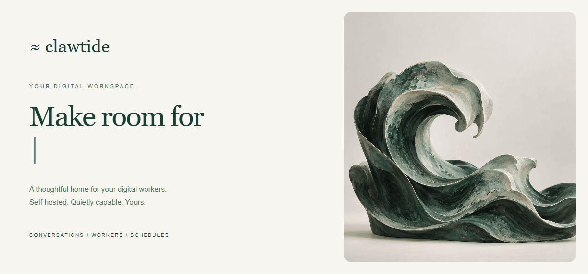
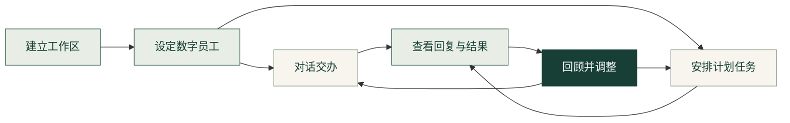
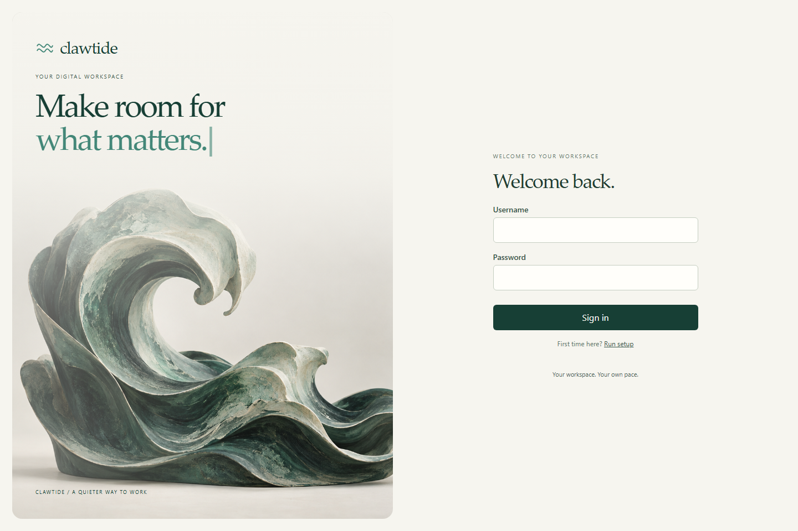
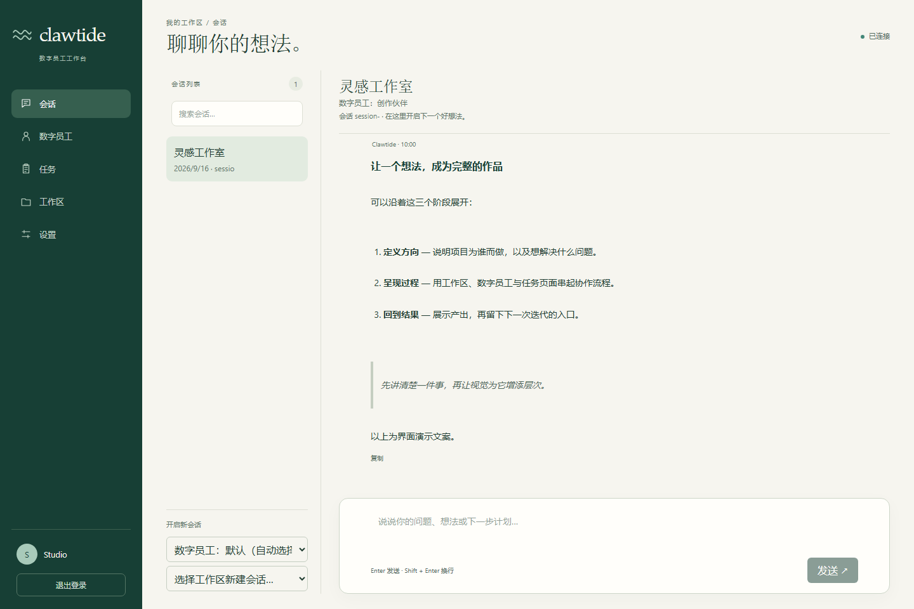
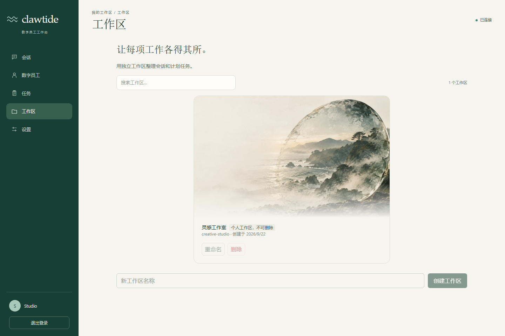
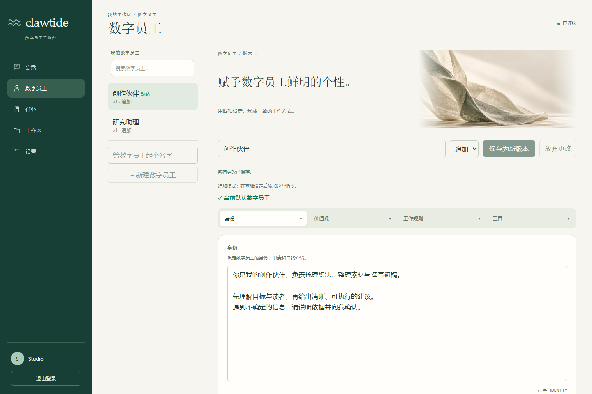
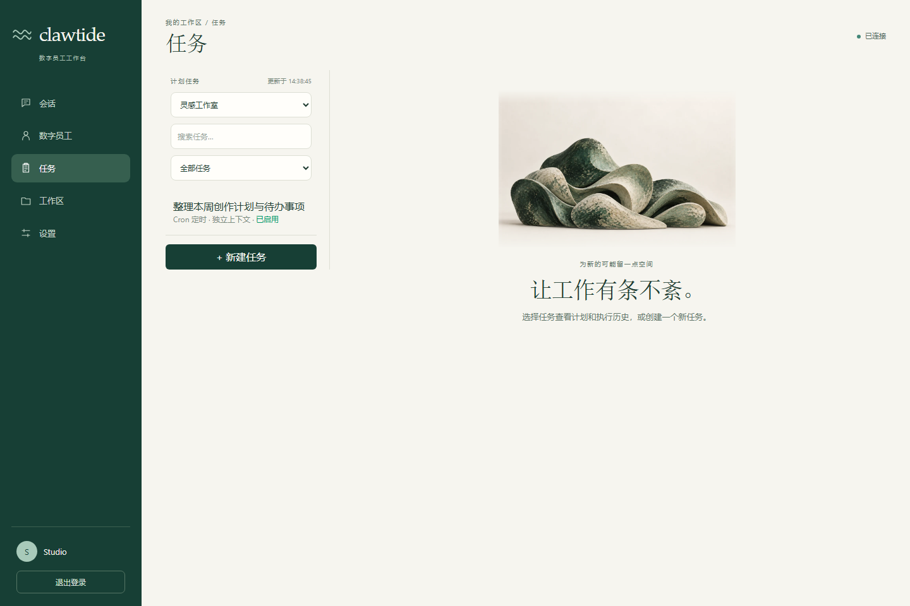
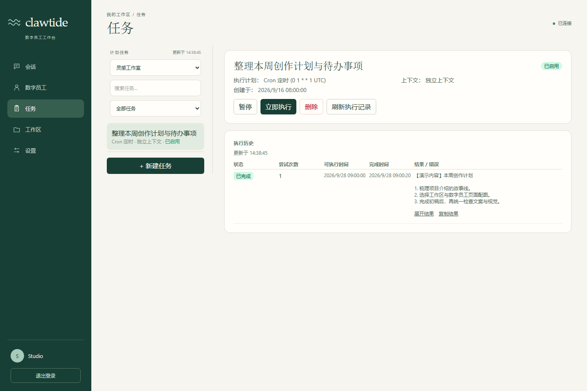
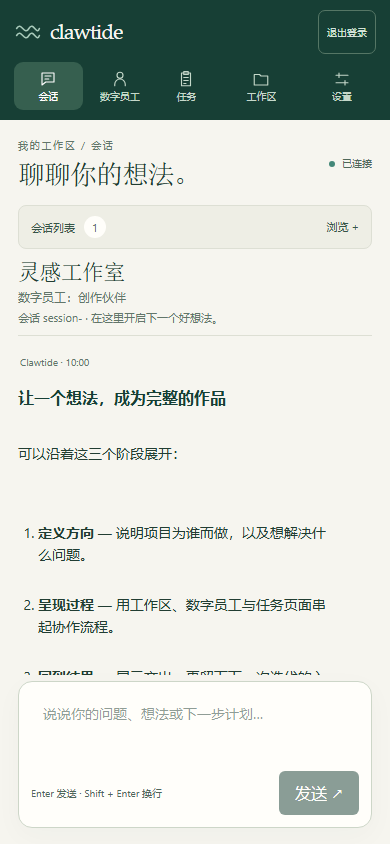
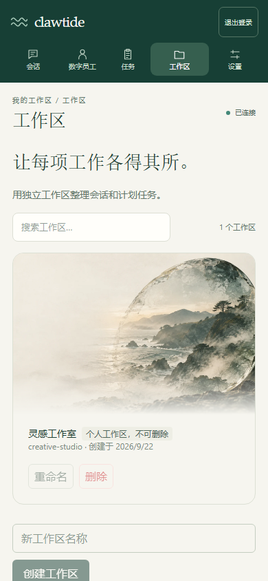

<div align="center">

# Clawtide

**让灵感有回响，让工作有着落。**

把数字员工、日常对话与计划任务，汇聚在一个从容有序的工作台。

_A self-hosted workspace for AI digital workers, conversations and scheduled tasks._

[](https://github.com/Bluuok/Clawtide/actions/workflows/ci.yml)
[](LICENSE)
[](package.json)
[](#quick-start)

[界面预览](#gallery) · [协作流程](#workflow) · [快速开始](#quick-start) · [项目文档](#docs)



[查看静态原画](web/public/images/tidal-sculpture.png)

</div>

## 🌊 为持续协作，留一张工作台

一个想法，往往需要不止一次对话。角色设定、工作上下文、待办安排和执行结果，也需要各自的位置。

Clawtide 是一个支持自托管、多用户使用的 AI 数字员工平台。你可以设定数字员工的工作方式，在独立工作区中组织会话，把重复事项交给计划任务，再通过结果与记录继续下一轮协作。

> 从定义角色，到交办任务，再到回顾结果，让每一步都有承接。

<a id="workflow"></a>

## 🧭 从一个想法，到下一次行动



| 你想做的事               | Clawtide 中的入口                                  |
| ------------------------ | -------------------------------------------------- |
| 整理不同主题的工作       | **工作区**：归拢会话与计划任务                     |
| 让协作拥有一致的风格     | **数字员工**：设定身份、价值观、工作规则与工具指引 |
| 随时讨论、拆解和推进想法 | **会话**：切换角色，查看流式回复与 Markdown 内容   |
| 把重复事项安排好         | **任务**：定时、间隔或单次执行，也可手动运行       |
| 回顾发生了什么           | **执行记录**：查看任务状态、结果与错误信息         |
| 连接自己的模型服务       | **设置**：由管理员配置兼容 Anthropic 的服务        |

<a id="gallery"></a>

## 🖥️ 看见 Clawtide

深绿、暖白与海岸意象，贯穿从登录到工作的每一个页面。

> 以下为当前界面的浏览器截图，使用演示账号与预设内容；对话和任务结果用于展示界面，不代表真实模型调用或生产运行记录。

### 欢迎回来，把注意力留给重要的事



### 一段对话，展开一条思路

选择工作区与数字员工，在同一处阅读回复、整理想法、继续追问。



| 让每项工作各得其所                                                                | 赋予协作鲜明的个性                                                              |
| --------------------------------------------------------------------------------- | ------------------------------------------------------------------------------- |
| [](docs/assets/readme/workspaces.png) | [](docs/assets/readme/profiles.png) |
| 用独立工作区承接会话与任务，保留清晰的组织方式。                                  | 分开编辑身份与工作指引，保存版本，让角色逐渐成形。                              |

| 让工作有条不紊                                                            | 让每次执行有迹可循                                                                      |
| ------------------------------------------------------------------------- | --------------------------------------------------------------------------------------- |
| [](docs/assets/readme/tasks.png) | [](docs/assets/readme/task-history.png) |
| 安排执行时间，按需暂停、恢复或立即运行。                                  | 查看历史状态与输出，再决定下一步行动。                                                  |

<details>
<summary><strong>📱 小屏幕，也能继续思考</strong></summary>

<br>

<p align="center">
  
  &nbsp;
  
</p>

会话列表可收起，工作区卡片随屏幕宽度排列。

</details>

<a id="quick-start"></a>

## 🚀 快速开始

需要 Node.js 与 npm。仓库声明 Node.js ≥ 20，当前 CI 使用 Node.js 22；安装与运行请使用同一 Node.js 版本。

**1. 获取项目并安装依赖**

```bash
git clone https://github.com/Bluuok/Clawtide.git
cd Clawtide
npm install
```

**2. 启动后端**

```bash
npm run dev
```

**3. 在另一个终端启动网页**

```bash
npm run dev:web
```

打开 **http://localhost:5173**，完成首次设置；第一个用户成为管理员。

**4. 连接模型，开始协作**

在「设置」中填写兼容 Anthropic 的模型服务 API Key；使用自定义服务时一并填写 Base URL。也可以通过 `ANTHROPIC_API_KEY` 环境变量提供密钥。随后建立工作区、设定数字员工，开始对话或创建任务。

未配置可用模型凭据时，真实 Agent 执行会失败并显示错误。界面预览不需要真实模型输出。

<details>
<summary><strong>构建、检查与本地配置</strong></summary>

```bash
npm run typecheck
npm run typecheck:web
npm test
npm run build
npm run build:web
```

服务默认监听 `127.0.0.1:3000`，开发网页使用 `5173`。数据默认保存在 `data/`，可通过 `DATA_DIR` 指定目录。

其他环境变量包括 `PORT`、`HOST`、`TRUST_PROXY`、`CORS_ALLOWED_ORIGINS`、`SESSION_TTL_DAYS`、`AUTH_MAX_ATTEMPTS`、`AUTH_LOCKOUT_MINUTES` 和 `LOG_LEVEL`。时间戳按 UTC 存储，Cron 表达式按 UTC 解释。

</details>

## 🔌 接入与实现边界

Web 会话、计划任务与 IM 消息汇入同一条 Agent Runtime 执行路径。各入口的接入程度如下：

| 入口                                  | 当前实现与验证范围                                                       |
| ------------------------------------- | ------------------------------------------------------------------------ |
| Web 控制台                            | 会话、数字员工、工作区、任务与模型服务配置                               |
| Telegram                              | 已接入 grammY；已有真实连接及消息进入、回复的验证记录                    |
| 飞书                                  | 已接入官方 SDK；已有真实长连接建立的验证记录，事件投递需要启用长连接订阅 |
| QQ / 钉钉 / 微信 / Discord / WhatsApp | 适配器骨架与模拟传输测试，尚未完成真实 SDK 接入                          |

Agent 使用 Claude Agent SDK。仓库中的自动化执行验证包含 SDK 事件替身；真实模型与 IM 使用还需要各自有效的凭据、配置和网络。接入记录不表示持续在线。

## 🧱 简单了解它如何组成

```text
React Web / IM 消息 / 计划任务
              │
        Agent Runtime
              │
    数字员工 · 工作区 · 会话
              │
    Claude Agent SDK + SQLite
```

- **前端**：React、TypeScript、Vite、Tailwind CSS。
- **服务端**：Node.js、Hono、WebSocket。
- **本地存储**：SQLite，保存角色配置、任务与运行记录等应用状态。
- **访问控制**：Cookie 登录、角色与资源归属校验。

更详细的调度、版本管理与权限实现见 [架构与实现](docs/ARCHITECTURE.md)。

<a id="docs"></a>

## 📚 继续了解

| 文档                                     | 内容                                      |
| ---------------------------------------- | ----------------------------------------- |
| [架构与实现](docs/ARCHITECTURE.md)       | Runtime、任务调度、数字员工版本与认证设计 |
| [API 说明](docs/API.md)                  | 接口分组与语义                            |
| [权限矩阵](docs/ACL-MATRIX.md)           | 角色、资源归属与操作权限                  |
| [安全说明](docs/SECURITY.md)             | 认证、访问控制与凭据保护                  |
| [截图说明](docs/assets/readme/README.md) | 展示素材的来源与演示范围                  |

## 🤝 参与项目

欢迎通过 [Issues](https://github.com/Bluuok/Clawtide/issues) 反馈问题或提出建议。提交改动时，请保持范围清晰，说明复现步骤与验证结果，并避免提交密钥和私人数据。

## 📄 开源与致谢

Clawtide 使用 [MIT License](LICENSE)。项目参考 [HappyClaw](https://github.com/riba2534) 的机制设计重新实现架构，并保留其 MIT 版权与来源声明：Copyright (c) 2025 riba2534。

README 展示结构参考 [OneTake](https://github.com/Sthreal/OneTake)，界面与图片均来自 Clawtide。
